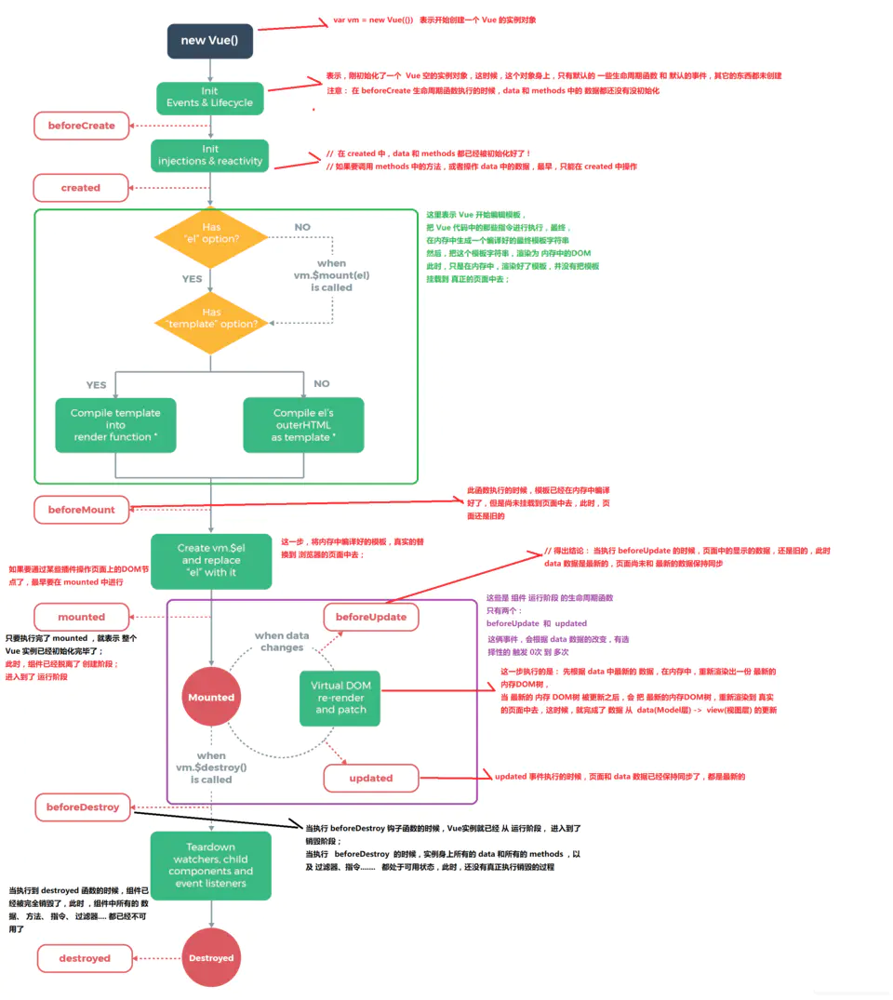

# vue

## 基本知识

## 高级特性

### 自定义事件，自定义组件V-model

* 不同于组件和prop,自定义事件名称需要完全匹配（不存在任何的大小写转化），组件自定义事件名使用`kebab-base` 而不是`kebabBase`

* 自定义组件的`v-model`

  父组件`<my-input v-model="testVal"/>`

  子组件

  ```
  <template>
  	<div>
  	  <input :value="testVal" @input="inputValHandler"/>
  	</div>
  </template>
  <script>
  	export{
  		model: {
  		   prop: 'inputed',
              event: 'changed'
  		},
  		props: ['inputed'],
          mathods: {
              inputValHandler(e){
                  thie.$emit('changed', e.target.value)
              }
          }
          
  	}
  </script>
  ```


### 动态,异步组件

​	动态组件

```
() => import('./..')
```


### slot

- 插槽的编译作用域

  父组件是不能直接访问子组件中的内容滴

   **父模板里的所有内容都是在父级作用域中编译的， 子模板里的所有内容都是在子作用域中编译的**

  ````
  <navigation-link url="/profile">
    Clicking here will send you to: {{ url }}
    <!--
    这里的 `url` 会是 undefined，因为其 (指该插槽的) 内容是
    _传递给_ <navigation-link> 的而不是
    在 <navigation-link> 组件*内部*定义的。
    -->
  </navigation-link>
  
  ````

- 后备内容

  可以在slot中添加一些默认的内容，如果父元素没有使用，则是该默认的

- 具名插槽

  出现在多个slot中， 一个不带name的`<slot>`出口会带有隐含的名字default

  `v-slot`只能添加再`<template>`上（除了独占默认插槽）

  ```
  //child
  <div>
          <header>
              <slot name="header"></slot>
          </header>
          <footer>
              <slot name="footer"></slot>
          </footer>
      </div>
  //parent
  <music-list>
      <template v-slot:footer>
      <div>我是尾部</div>
      </template>
      <template v-slot:header>
      <div>我是头部</div>
      </template>
  </music-list>
  ```

- 作用域插槽

  为了能够访问子组件的内容， 可以将子组件中slot标签上绑定一个属性，绑定在slot元素上的属性成为**插槽prop** ,可以在父元素上

  ````
  //child
  <div>
      <header>
      <slot name="header" :head-obj="firstName"></slot>
      </header>
      <footer>
      <slot name="footer" :foot-obj="lastName"></slot>
      </footer>
  </div>
   data(){
     return {
         firstName: 'first name',
         lastName: 'last name'
     }
    }
    
  //parent
  <music-list>
        <template v-slot:footer="foName">
          <div>
            {{foName.headObj.firstName}}
            我是尾部
          </div>
        </template>
        <template v-slot:header="heName">
          <div>
            {{heName.footObj.lastName}}
            我是头部
          </div>
        </template>
      </music-list>
  ````

- 独个插槽使用

  ````
  <music-list v-solot="obj">
   </music-list>
  ````

  

- 解构插槽`prop`

  可以使用es6语法，

  ````
  //parent
  <music-list>
        <template v-slot:footer="{headObj}">
          <div>
            {{foName.headObj.firstName}}
            我是尾部
          </div>
        </template>
        <template v-slot:header="heName">
          <div>
            {{heName.footObj.lastName}}
            我是头部
          </div>
        </template>
      </music-list>
  ````

- 动态插槽的插槽名 `<template v-slot:[dynamicSlotName]>...</template>`

- `v-slot:`缩写为`#` eg: `v-slot:header` 可以被重写为`#header`

- 

### $nextTick

​	在下一次渲染更新之后调用

### keep-alive

​	保持存活

### mixin

​	代码复用

1. 缺点 代码引用不明确，不利于维护
2. 方法名，变量名容易冲突

### 自定义指令

除了`v-model` `v-show`等内置指令外， vue也可以注册自定义指令。一般用于对普通DOM元素进行底层操作， 如： 自动获取输入框的焦点(autofocus 在移动版safari不工作)，可以自定义指令实现

````
//全局注册
Vue.directive('focus', {
 //当被绑定的元素插入到DOM中时
 inserted: function(el){
 	//聚焦元素
 	el.focus()
 }
})
//也可以局部注册
directives: {
  focus: {
  	//指令的定义
  	inserted: function(el){
  		el.focus()
  	}
  }
}
//使用
<input v-focus>
````

**钩子函数**

- bind: 只掉用一次，指令第一次绑定到元素时调用。在这里可以进行一次性的初始化设置
- inserted: 被绑定元素插入父节点时调用（仅保证父节点存在，但不一定已被插入文档中）
- update: 所在组件的VNode更新时调用，看可能发生在其子VNode更新之前。指令的值可能发生改变，也可能没有。是你可以通过比较更新前后的值来忽略不必要的模板更新
- componentUpdated: 指令所在组件的 VNode **及其子 VNode** 全部更新后调用
- unbind: 只调用一次，指令与元素解绑时调用

指令函数能够接受所有合法的 JavaScript 表达式。

## 复习的知识点

### MVVM

### 声明周期

### 数据绑定

### 状态管理

### 组件通信

### computed/watch 原理

### Virtual Dom

### diff

## 面试题

[面试题1](https://juejin.cn/post/6844903918753808398)


### 陌生的一些题

#### 直接给一个数组项赋值，vue能检测到吗

**如果在实例创建之后添加新的属性到实例上，它不会触发视图更新** 

由于js的限制， vue不能检测到以下数组的变动

- 当你利用索引直接设置一个数组项时， 例如`vm.items[indexOfItem] = newVal`
- 当你修改数组长度时，例如`vm.items.length = newLength`

为了解决第一个问题， vue提供一下操作

````
Vue.set(vm.items, indexOfItem, newValue)
Vue.$set(vm.items, indexOfItem, newValue)//Vue.set的别名
vm.items.splice(indexOfItem, 1, newValue)
````

为了解决第二个问题，vue提供了一下操作

````
vm.items.splice(newLength)
````

#### vue的生命周期

1. 生命周期是什么

   vue实例有一个完整的生命周期，也就是从开始创建、初始化数据、编译模板、挂在DOM->渲染、更新->渲染、卸载等一系列过程，我们称这就是vue的生命周期

2. 各个生命周期的作用

   | 生命周期      | 描述                                                         |
   | ------------- | ------------------------------------------------------------ |
   | beforeCreate  | 组件实例被创建之前调用，组件的属性生效之前                   |
   | created       | 组件实例创建完成后被调用，属性也已经被绑定，但真实的dom还没有生成，$el还不可用 |
   | beforeMount   | 组件挂载之前调用，相关的render函数首次调用                   |
   | mounted       | el被创建的vm.$el替换， 并挂在到实例上去之后调用该钩子        |
   | beforeUpdate  | 组件数据更新之前调用，发生在虚拟DOM打补丁之前，              |
   | updated       | 组件数据更新之后                                             |
   | activited     | keep-alive专属，组件被激活时候调用                           |
   | deactivited   | keep-alive专属，组件被销毁时候调用                           |
   | beforeDestory | 组件古北销毁前调用（可以初始化一些数据，防止内存泄漏）       |
   | destoryed     | 组件销毁时调用                                               |

3. 


#### vue父子组件生命周期钩子执行顺序

- 加载渲染过程

  ````
  父-beforeCreate -> 父-created -> 父-beforeMount -> 子-beforeCreate -> 子-created -> 子-beforeMount -> 子-mounted -> 父-mounted
  ````

- 父组件更新

  ````
  父-beforeUpdate -> 父-updated
  ````

- 子组件更新

  ````
  父-beforeUpdate -> 子-beforeUpdate -> 子-updated -> 父-updated
  ````

- 销毁过程

  `````
  父-beforeDestory -> 子-beforeDestory -> 子destoryed -> 父destoryed
  `````

#### 父组件监听子组件的生命周期

如果想在父组件想在子组件的mounted做点事情

```
//父组件
<child @mounted="doSomthing"></child>
methods: {
    doSomthing(){}
}

//子组件
mounted(){
    this.$emit('mounted')
}
```

使用`hook` 省去子组件的emit

```
//父组件
<child @hook:mounted="doSomthing"></child>
methods: {
    doSomthing(){}
}
```

在任意地方使用`Vue.$on/$once('hook:生命周期'， callback)`可以监听生命周期

#### vue-router的路由模式有几种？

- history
- hash
- abstract 在js运行环境中转为abstract

#### vue是如何实现双向绑定的

